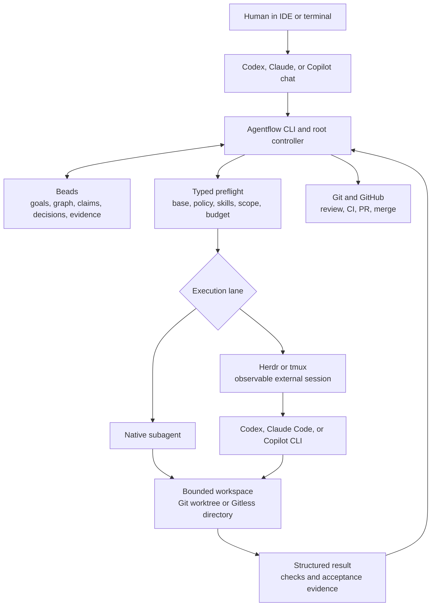

# Agentflow

Agentflow is a provider-neutral CLI for coordinating coding agents around an
approved goal. It keeps durable work and dependencies in
[Beads](https://github.com/steveyegge/beads), validates handoffs before launch,
and records evidence without treating chat transcripts as project state.

The Python distribution is named `saintdle-agentflow`; the product, repository,
Python import package, and installed command are all named `agentflow`. The
unqualified `agentflow` and `agentflow-cli` names on package indexes belong to
unrelated projects.

> [!WARNING]
> The majority of this code was generated with AI coding agents. Multiple
> Codex, Claude, and GitHub Copilot agents produced and reviewed it while
> Agentflow was used to orchestrate its own development. That dogfooding is
> useful evidence, not a safety guarantee. Agentflow is currently suitable
> only for development and testing; do not rely on it for production,
> unattended privileged automation, or irreplaceable data. Review its plans,
> permissions, diffs, and backups as though untrusted automation may fail.

> [!IMPORTANT]
> Agentflow `0.0.4` is a public preview. Its commands, configuration schema,
> and compatibility guarantees may change before `1.0`.

## What it provides

- A controller workflow built around goals, bounded assignments, claims,
  acceptance evidence, review, and integration.
- Controller-only orchestration with graph-derived launch, parallelism, depth,
  retry, and expensive-model budgets.
- Metadata-only context auditing and required safe-boundary rotation, so long
  workflows resume from durable state instead of accumulating chat history.
- Provider-neutral handoffs for Codex, Claude Code, and GitHub Copilot CLI.
- Beads-backed durable coordination, including Git-backed and Gitless work.
- Seven bundled generic workflow skills and five provider-role profiles for
  each supported coding-agent provider.
- Project initialization that preserves existing agent instructions and hooks.
- Config-driven discovery and installation of your own skills.
- Optional observable external-agent sessions through Herdr.
- Beads/Herdr lifecycle reconciliation for claims, sessions, results, and
  dispositions.
- Fail-closed preflight, model policy, imported-asset verification, and
  macOS-only hardened subprocess isolation.
- A conditional prose-quality lane for Claude-authored reader content: free
  deterministic checks first, then at most one bounded edit through a
  configurable exact provider route when needed, with source preservation and
  domain validation. Luna-medium is the default, not a dependency.

Agentflow routes skills; it does not replace domain expertise. A repository's
own skills and instructions remain authoritative.

See [Conditional prose quality](docs/PROSE_QUALITY.md) for controller-driven
blog, documentation, and Instruqt examples.

## How the components fit together

Agentflow is the coordination layer between a human-approved goal, durable
Beads state, coding-agent providers, and the project being changed. Git and
GitHub remain the source-of-truth integration boundary.



The controller is the only component that owns root workflow authority. Worker
sessions receive a task-scoped handoff and return evidence; they do not decide
that the overall goal is complete. See the [workflow guide](docs/WORKFLOW.md)
and [security model](docs/SECURITY.md) for the detailed lifecycle and trust
boundaries.

## Requirements

- Python 3.10 or later.
- [Beads](https://github.com/steveyegge/beads) 1.1 or later and its `bd` CLI.
- Git for Git-backed projects.
- At least one supported coding-agent CLI for delegated work: Codex, Claude
  Code, or GitHub Copilot CLI.

Optional tools:

- [Herdr](https://github.com/ogulcancelik/herdr) for observable external sessions.
- GitHub CLI (`gh`) for GitHub issue and pull-request workflows.
- `tmux` as a portable fallback for external sessions.

Provider subscriptions, credentials, usage allowances, and terms are managed
by their respective providers. Agentflow does not supply or authenticate them.

## Install

### Ask a coding agent to do it

You can point a ChatGPT/Codex or Claude coding-agent chat at this repository and
ask it to install and configure Agentflow. Copy the request in
[the agent-led setup contract](AGENT_SETUP.md). It tells the agent how to verify
the package identity, preserve existing provider configuration, handle a legacy
installation transactionally, initialize the current workspace, and report a
rollback path.

For manual installation, continue below.

The cleanest installation uses an isolated Python tool environment:

```sh
uv tool install "git+https://github.com/saintdle/agentflow.git@v0.0.4"
# or
pipx install "git+https://github.com/saintdle/agentflow.git@v0.0.4"
```

Until the repository is public, an authenticated GitHub checkout or Git
credential helper is required. To install from a downloaded release wheel:

```sh
pipx install ./saintdle_agentflow-0.0.4-py3-none-any.whl
```

Verify the installation and prerequisites without exposing credentials:

```sh
agentflow --version
agentflow doctor
```

The wheel contains Agentflow's seven generic workflow skills and the controller,
worker, explorer, reviewer, and pull-request gatekeeper profiles for each
supported provider. Preview and then install those bundled assets separately:

```sh
agentflow install --dry-run
agentflow install
```

Existing provider files are preserved for manual review.

For development and clean-build instructions, see
[Installation](docs/INSTALLATION.md).

## Quick start

Initialize Agentflow and Beads in an existing Git repository:

```sh
cd /path/to/project
agentflow init . --beads
agentflow beads status .
agentflow doctor
```

For a working directory that will not use Git:

```sh
mkdir my-work
cd my-work
agentflow init . --beads
```

Initialization creates only missing workflow files, preserves existing agent
instructions and custom hooks, and keeps runtime state out of version control.
The default Beads setup is local/stealth. Choose tracked or shared-server state
only when that collaboration model is intentional.

Continue with the executable [first workflow tutorial](docs/FIRST_WORKFLOW.md)
to create and approve a root/task graph, run the controller, handle a halt, and
record completion evidence.

If you prefer to work entirely through a ChatGPT/Codex or Claude chat, use the
[chat-first workflow guide](docs/CHAT_WORKFLOWS.md). It provides copy/paste
prompts for planning without launch, explicit approval, autonomous persistent
execution, reconnect-safe resume, read-only status, and bounded PR delivery.

For local optimization evidence, `agentflow usage optimize --codeburn <report>`
reconciles CodeBurn JSON with Agentflow delivery records while keeping savings
estimates explicitly advisory.

Audit recent model routing, lineage, recorded token counters, and context
pressure without copying provider transcripts:

```sh
agentflow history sync --dry-run
agentflow history sync
agentflow context audit --root . --days 30
agentflow herdr reconcile --root . --workflow-root <root-id>
```

## Bring your own skills

Bundled Agentflow workflow skills are installed by `agentflow install`. The
commands below manage additional project or user domain skills without
repackaging Agentflow.

Register a local skill source in project configuration, synchronize it, then
check that Agentflow can resolve it:

```sh
agentflow skills add ./skills/my-domain-skill
agentflow skills sync
agentflow skills list
agentflow skills doctor
```

Skill sources may live inside the project or at an explicit external path.
Project configuration is shareable when it uses repository-relative paths;
machine-specific sources are stored in the ignored
`.agentflow/config.local.json` layer. Synchronization never silently overwrites
an unrelated installed skill. See
[Skill configuration](docs/SKILLS.md) for config examples, provider discovery
locations, and team-safe setup patterns.

## Platform support

| Platform | Core CLI | Hardened isolation |
| --- | --- | --- |
| macOS | Supported | Available through `sandbox-exec`; probes fail closed |
| Linux | Supported | Not available in `0.0.4`; requests fail closed |
| Windows | Not supported in `0.0.4` | Not available |

Core coordination can run on macOS and Linux. Hardened isolation is a distinct,
macOS-only security control; ordinary execution on Linux is not equivalent
confinement. In `0.0.4`, `agentflow isolation launch` provides synchronous
hardened execution. Direct handoff and persistent Herdr/controller launches
reject hardened profiles rather than treating a successful probe as confinement.

## Documentation

- [Agent-led installation and setup](AGENT_SETUP.md)
- [Chat-first workflows and copy/paste prompts](docs/CHAT_WORKFLOWS.md)
- [Installation, upgrades, and legacy migration](docs/INSTALLATION.md)
- [Transactional legacy cutover and rollback](docs/MIGRATION.md)
- [First workflow tutorial](docs/FIRST_WORKFLOW.md)
- [Configuration](docs/CONFIGURATION.md)
- [Local session history and context audit](docs/HISTORY.md)
- [Bring your own skills](docs/SKILLS.md)
- [Workflow guide](docs/WORKFLOW.md)
- [Security model](docs/SECURITY.md)
- [Authorship and third-party provenance](docs/PROVENANCE.md)
- [Security reporting](SECURITY.md)
- [Contributing](CONTRIBUTING.md)
- [Support](SUPPORT.md)
- [Governance](GOVERNANCE.md)

## Project status and releases

`0.0.4` is intended for development/testing and feedback. Pull requests run validation
and package-build checks. Merges to `main` build the CLI distribution artifacts;
tagged releases are the versioned distribution boundary. See
[the changelog](CHANGELOG.md) and [release process](CONTRIBUTING.md#releases).

## Licence and trademarks

Agentflow is licensed under the [Apache License 2.0](LICENSE). Third-party
attributions are recorded in [THIRD_PARTY_NOTICES.md](THIRD_PARTY_NOTICES.md)
and the detailed [provenance inventory](docs/PROVENANCE.md). Adapted skills
also carry provenance and licence notices beside their code.

Agentflow is an independent project. It is not affiliated with or endorsed by
OpenAI, Anthropic, GitHub, Microsoft, Beads, Herdr, or their owners. All product
and company names are trademarks of their respective owners.
