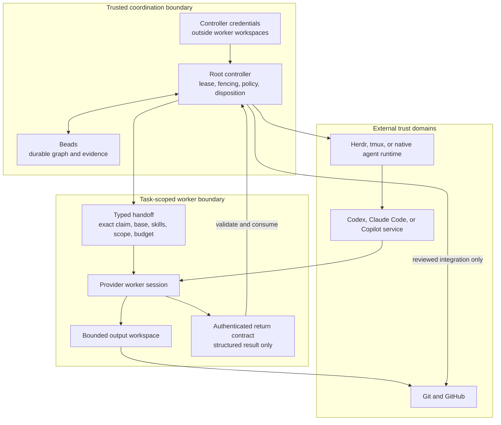

# Security model

This document describes Agentflow's technical security boundary. To report a
vulnerability, use the private process in the root [SECURITY.md](../SECURITY.md).

## Trust boundary

The controller is trusted to hold workflow authority, mutate durable state,
validate results, and dispatch work. Workers and provider sessions are less
trusted. They receive task-scoped context and output locations, not controller
credentials or unrestricted authority to mark themselves complete.

Agentflow aims to protect:

- controller credentials and fencing state;
- exact task, claim, base, provider, model, policy, and handoff identity;
- acceptance evidence and reviewer dispositions;
- imported-skill provenance;
- local metadata archives and redacted diagnostics.

Agentflow does not make a coding agent trustworthy, secure a compromised user
account, replace operating-system access control, inspect provider-side data
handling, or guarantee that generated code is safe.



Controller credentials and raw provider transcripts do not cross into the
task-scoped worker boundary. The return channel carries a bounded result that
the controller authenticates and validates before changing durable task state.

The controller also binds its native provider-session identity to the approved
workflow workspace in protected user state. Hooks validate that binding against
the current controller lease before selecting project memory or Beads. The raw
provider session identifier is hashed and is never stored in the binding.

## Controller authority

Controller credentials live outside worker workspaces with restrictive file
permissions. Public lease identifiers are not resume credentials. Reattachment
rotates credentials and fences stale processes from mutation. Provider-visible
return contracts are bounded and authenticated; only the controller validates
and consumes a matching result.

Do not copy controller state into a repository, shared worktree, provider
prompt, or support report.

## Preflight and provider policy

External launch preflight binds the exact work root, task, base revision,
claim, provider, model, role, effort, policy version, handoff, required tools,
required skills, output boundary, and budget. Missing or ambiguous
security-relevant input blocks launch.

A model policy is local governance, not proof of provider identity or service
security. Agentflow records the requested model in the return contract and
compares it with lifecycle events written to its local event spool for the
bound provider session. Claude's SessionStart and PostModelSwitch events are
cooperative observations, not provider-signed or cryptographically protected
proof; a same-UID process that can alter the spool or hook delivery can forge
or change them. Missing evidence or a recorded mismatch fails closed. Claude
launch checks known project, user, and file-managed settings for hook
suppression before launch, but dynamic server-managed or MDM policy is not
reliably observable by that preflight and may change during a session. This is
not a guarantee that the effective hook policy was proven before provider cost
was incurred. Claude's session-level fallback is constrained to the requested
primary model; PostModelSwitch is not a per-response model attestation. Use
exact provider identifiers, install the provider hooks, and review policy
changes.

## External return channels and sterile packages

Every external handoff generated by Agentflow describes the protected result
contract. Only a leased root controller can mint that channel. Direct
`agentflow handoff launch` therefore refuses external handoffs before provider
spawn instead of promising an unavailable result path.

A native handoff is intentionally different: it is a bounded direct provider
session, returns through that session, and contains no machine result-file
contract. This keeps direct utilities such as the conditional prose editor
usable without falsely advertising controller-owned environment variables.
Controller dispatch always materializes external mode before Herdr launch.

Tasks whose persisted launch metadata contains `"sterile": true` or
`"outbound_context": "restricted"` execute from a separate package in the
Agentflow user-state directory. The package contains only the regenerated typed
handoff, explicit local context files, its acceptance matrix, and self-contained
pinned skill packages. Agentflow revalidates the source pin immediately before
copying and verifies the copied package digest. Repository instruction files
are excluded and cannot be declared as context. A complete relative-path/
SHA-256 inventory is checked
before every spawn; extra files, symlinks, missing files, and changed bytes
block launch. Controller authority, Beads, claims, and result state remain in
the original workflow workspace.

The current sterile lane is read-only. Agentflow rejects `shell-write` sterile
handoffs because it does not yet have a separately reviewed import contract for
copying package changes back into the workflow workspace.

Sterile packaging narrows what is intentionally delivered to a provider. It is
not an operating-system sandbox and does not prevent a same-user process from
reading other accessible paths. Combine it with an appropriate machine,
container, or reviewed isolation boundary when local filesystem confidentiality
depends on enforcement rather than launch discipline.

## Hardened isolation

Hardened subprocess isolation in `0.0.5` is available only on macOS through
`/usr/bin/sandbox-exec`. Process execution, writes, and network access are
deny-by-default. Reads use a different boundary: the profile permits blanket
system reads so interpreters and toolchains can start, denies protected home
roots such as `/Users`, and then explicitly re-allows only caller-declared
read/write roots plus an ephemeral home. Undeclared system paths such as
`/private/tmp`, `/opt`, or mounted volumes may therefore remain readable. It
also bounds resources and runtime and tears down the process group on timeout.

```sh
agentflow isolation probe --write /path/to/scratch
agentflow isolation launch --write /path/to/scratch -- python3 script.py
```

The probe validates controls against fresh state, but a successful probe is not
confinement for a later process. `agentflow isolation launch` is the separate,
synchronous path that applies the generated hardened profile to the supplied
command. A missing control, ambiguous network result, unavailable
`sandbox-exec`, or non-macOS host fails closed.

Direct `agentflow handoff launch` validates native handoffs against exact role,
model, effort, and policy. External handoffs require the controller-owned Herdr
path. Neither path is the synchronous isolation path: a handoff declaring
`isolation_profile: hardened` is rejected rather than launched unconfined.
Authenticated Herdr/controller launch also rejects hardened handoffs in
`0.0.5`, because a probe cannot confine the later persistent provider session.
Use `agentflow isolation launch` for synchronous hardened commands;
persistent-session confinement is not currently provided.

Linux can run the core CLI but has no equivalent hardened isolation in `0.0.5`.
Running a command in a shell, virtual environment, worktree, or terminal
multiplexer is not an isolation boundary.

`sandbox-exec` is a platform facility with its own limitations. Use a dedicated
machine, virtual machine, or reviewed container boundary for genuinely hostile
code or high-value credentials. Do not place secrets in globally readable
temporary, toolchain, or mounted-volume paths and rely on Agentflow to hide
them.

## Publication history gate

The security workflow fetches every branch and tag and scans every reachable
historical blob, not only the current checkout. It rejects credential
signatures, personal home paths, sensitive file names, provider transcripts,
Agentflow runtime state, and Beads database artifacts even if they were later
deleted from `HEAD`.

Maintainers can configure a newline-delimited
`AGENTFLOW_PUBLICATION_DENYLIST` repository secret for organization-specific
names or paths. The scanner reports only a redacted finding code, object ID,
and repository path; it never echoes a matched marker. The secret-backed pass
runs only on trusted non-pull-request events so unreviewed PR code never
receives the private denylist.

Before a repository becomes public, run the same scanner locally with an
owner-readable denylist file and inspect all fetched refs:

```sh
git fetch --force --prune origin '+refs/heads/*:refs/remotes/origin/*' \
  '+refs/tags/*:refs/tags/*'
python scripts/ci/scan_git_history.py . --denylist-file /private/path/denylist.txt
```

A finding in published history requires a deliberate credential response and,
when appropriate, a separately approved history rewrite. Deleting the current
file is not remediation.

## Imported assets and skills

Skills, plugins, hooks, MCP packages, and provider profiles can influence agent
behavior or execute code. Treat them as supply-chain inputs. Agentflow's asset
lock records source provenance, immutable revision, package digest, licences,
capabilities, and approval. Verification rejects unlocked, changed, or
capability-expanded material.

Review assets before locking them. A valid digest proves identity, not safety.
Do not grant a skill controller credentials or broad write access merely
because it is installed.

## Filesystem and Git safety

Initialization creates only missing files and preserves unrelated user
configuration. Managed ignore markers keep runtime authority and temporary
artifacts out of Git. Malformed markers halt for review rather than rewriting
the file.

Worktree retirement and destructive cleanup require explicit checks. Never use
unresolved home-directory variables, repository roots, or broad globs as
destructive targets.

## Data minimization

Diagnostics and history records are metadata-only and should redact sensitive
paths. Agentflow does not need credential-file contents. Never commit or share:

- access tokens, cookies, signing keys, or controller credentials;
- provider prompts, responses, reasoning, or tool logs;
- customer, employer, billing, or subscription data;
- local runtime directories or private session archives.

Before release, scan both the current tree and Git history for secrets and
private material.

## Dependencies

Beads, provider CLIs, Herdr, GitHub CLI, Git, Python, and the operating system
remain separate trust domains. Pin supported versions where practical, monitor
their advisories, and reproduce integration bugs independently before deciding
which project owns the fix.
