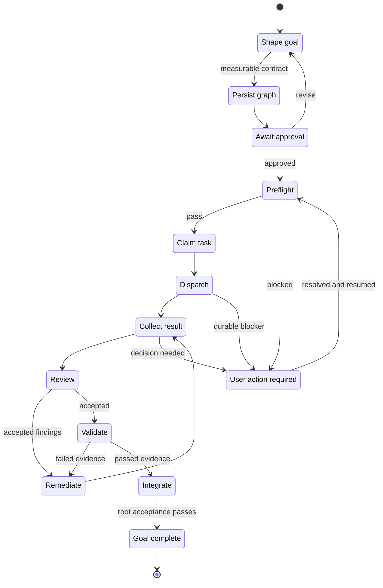

# Workflow guide

Agentflow separates durable project state from disposable agent sessions.
Beads records goals, tasks, dependencies, claims, decisions, and acceptance
evidence. Git and GitHub remain authoritative for source history, issues, pull
requests, reviews, and merges.

## Lifecycle at a glance

The approved root controller advances the graph until the goal is complete or
a durable decision is required. Provider panes and individual tasks are
intermediate state, not completion signals.

One controller chat should own one approved root. The default controller is
controller-only: it shapes, routes, dispositions, and integrates while bounded
workers perform product-file edits. Related review and remediation
remain children of that root; a materially different goal starts a new root in a
fresh chat. Agentflow records a task-aware session budget and can produce a
minimal `controller rotate` packet so another chat resumes from Beads and
controller state rather than replaying a transcript. A required rotation waits
until the current worker result is safely dispositioned, then stops before the
next wave. Repeating the same named failed approach twice also creates a durable
decision halt.

The provider chat may have started from another open project or a global skill.
Once the controller lease is acquired, Agentflow binds that provider session to
the approved workflow workspace. Subsequent hooks resolve Beads and optional
memory from the binding rather than the editor's incidental current directory.



`USER_ACTION_REQUIRED` preserves the root, claims, results, and evidence. Resume
the existing root after resolving the recorded cause; do not create a duplicate
graph or treat a disconnected chat as a new workflow.

## Separate-terminal supervision

For work that should keep advancing after the initiating chat closes, run one
supervisor in a separate terminal:

```sh
agentflow controller supervise --root . --workflow-root <root-id>
```

The command validates the exact Beads root before creating lease state, then
holds a per-root OS lock in the protected user state directory and heartbeats
the controller lease while it polls Beads and Herdr. Idle polls make no
provider/model calls; a provider is launched only when a ready task passes the
normal preflight. The first run creates the protected external credential used
for an explicit process restart. If the supervisor exits or crashes, rerun the
same command: after acquiring the lock and verifying the credential, it
continues the existing lease without rotating its fencing token or relaunching
durably recorded live tasks. Reusing the same epoch is safe because every
current `start`, `resume`, and `supervise` runner takes that lock before lease
authentication; only one can own the root at a time. Stop any runner from an
older Agentflow release that predates this lock before starting supervision. A
concurrent `start`, `resume`, or `supervise` for that root is refused while the
lock is held. There is no automatic takeover; if the protected credential is
missing or invalid, stop and recover it rather than replacing the lease.

The supervisor stops at `GOAL_COMPLETE`, `TASK_BLOCKED`,
`USER_ACTION_REQUIRED`, or `ROTATION_REQUIRED`. A loop deadline writes a
resumable `incomplete` checkpoint with `DEADLINE_EXCEEDED` and exits with code
3; it does not discard live task state. `--deadline 0` is an immediate deadline.
After resolving the cause or extending the budget, explicitly rerun
`controller supervise` to continue from the checkpoint.

## Default lifecycle

1. Define an observable goal and approve its exit conditions.
2. For substantial or environment-dependent work, map each acceptance
   condition to authoritative evidence.
3. Create bounded Beads tasks with explicit dependencies and ownership.
4. Select a native worker or an observable external session.
5. Preflight the exact base, tools, skills, output boundary, budget, retries,
   and delegation depth.
6. Claim work before mutation and keep concurrent writers in disjoint scopes.
7. Return structured outcome and evidence, not a transcript dump.
8. Review changes independently and route accepted corrections to their owner.
9. Integrate ready work in priority/FIFO order and validate the original goal.

The root execution policy derives its launch budget from graph size and bounds
parallel workers, delegation depth, per-task attempts, and expensive execution
children. Luna and Sonnet are the normal coding/exploration routes. Sol and Opus
remain controller/judgment/review routes. Terra is available only through an
explicitly selected exact route with a persisted rationale.

## Execution lanes

Use native subagents for bounded, fire-and-forget work. Use Herdr for
controller-managed, long-running, cross-provider, worktree-owned, or
decision-prone sessions where observation or direct intervention is useful.
`tmux` is available for manually managed terminal handoffs only, not controller
dispatch. A live pane is an attention signal, never proof of correctness or
completion.

Generated native handoffs are direct-session contracts: they return in the
provider session and never claim that controller-owned result files exist.
Generated external handoffs are controller contracts and always require the
leased controller's authenticated return channel.

External launches consume provider allowance and therefore remain explicit
unless an approved controller is operating within its recorded budget.
Native Codex workers use a dedicated Luna profile with no inherited controller
conversation (`fork_turns="none"`) or the smallest context slice that contains
the task contract.

External workers always return through the controller-minted authenticated
channel. Do not launch their generated handoffs with `agentflow handoff launch`;
resume the root controller. When outbound context must be restricted, persist
`sterile: true` in `metadata.agentflow.launch`. The controller packages only
declared context, acceptance data, and self-contained pinned skills, verifies
the package inventory, and asks Herdr to use that package as the worker cwd.
The current sterile lane is read-only and rejects `shell-write`; this is
context minimization, not an OS sandbox.

## Durable Beads coordination

Initialize Beads deliberately:

```sh
agentflow init . --beads
agentflow beads status .
```

Use one approved root for an Agentflow queue. Each task needs an observable
result, exact scope, dependencies, acceptance evidence, checks, constraints,
and a halt condition. Claims are actor-bound and time-bounded. A task being
ready or assigned does not prove that a worker session is live.

Gitless projects can use Beads and Agentflow runtime state without inventing
branches, commits, pull requests, or merge gates. Serialize overlapping file
writes in that mode. External handoffs use a typed workspace contract: Git
roots pin an exact `branch@SHA`, while non-Git directories carry no Git base
and bind to their canonical absolute directory path. Preflight fails closed if
the selected workspace type or exact root differs from the handoff.

Compare Beads claims and dispositions with Herdr sessions whenever status is
unclear:

```sh
agentflow herdr reconcile --root . --workflow-root <root-id>
```

The report distinguishes claims without sessions, active sessions for terminal
Beads, results awaiting disposition, and sessions outside the requested root.
It does not treat a closed Bead or pane exit alone as authenticated completion.

## Skill routing

Keep domain skills with the project or register them through Agentflow's skill
configuration. Name required skills in every delegated assignment. Preflight
from the worker's actual checkout and stop if a required entrypoint or content
digest cannot be verified. See [SKILLS.md](SKILLS.md).

## Handoff contract

A useful assignment states:

```text
objective: one observable result
scope: owned files or read-only question
base: branch and exact revision
dependencies: task identifiers or none
acceptance: testable conditions
verify: exact commands or evidence sources
constraints: permissions and do-not rules
budget: time/cost cap, retry cap, and stop condition
return: outcome, revision, checks, risks, and references
```

If blocked, the worker stops and returns one decision or dependency, what was
tried, available options, a recommendation, and preserved state.

## Review and integration

Reviews should distinguish correctness, security, regression, and missing-test
findings from preferences. High- and medium-severity findings require exact
evidence and deterministic reproduction before they are routed as corrections.
The original writer owns fix rounds when practical; reviewers do not silently
rewrite another worker's scope.

Workers do not merge their own pull requests. Integrate one completed branch at
a time, verify its recorded base, and rerun affected checks after integration.

## Hooks

Agentflow hooks are small and advisory. They may record lifecycle events or
provide a workflow reminder, but they do not inspect prompts to select domain
expertise, publish issues, approve goals, or decide that work is complete.
Initialization preserves custom hooks for deliberate manual merging.

Codex context is returned through `hookSpecificOutput` with the native
`hookEventName` and `additionalContext`; Codex events without a documented
context field receive no context output. Claude keeps the same supported
response shape, and Copilot keeps its existing `additionalContext` shape
without a new provider-limit claim. Agentflow limits its assembled hook string to 2,000 UTF-8
bytes for Codex and 9,000 Unicode characters for Claude. These local limits
include the full guidance, Beads authority guard, separators, memory safety
header, records, and provenance. They do not estimate tokens or promise provider
acceptance. Optional Beads prime and memory records are included whole or
omitted with a reason.

Versioned local receipts distinguish preparation from a successful write to
hook stdout. A receipt for emitted output proves only that Agentflow serialized
and wrote its local response. It does not prove provider acceptance or model
input. Earlier receipt records remain preparation observations. Receipts keep
component hashes, sizes, counts, and event metadata; they do not store prompt,
prime, or memory text. Installed-client acceptance and exact model-input
delivery remain unvalidated.

## Evidence and privacy

Record commands, revisions, test results, and links that substantiate the goal.
Do not store prompts, reasoning traces, credentials, provider logs, or account
data as durable coordination state. Metadata-only audit and history facilities
do not make private material safe to publish.

## Paired usage pilots

The existing `agentflow usage yield` report remains grouped by explicit task
class. Add `--evaluation` to compare paired baseline and treatment observations
for a small pilot. Choose representative cases first, assign one stable
evaluation ID and case ID to each pair, and keep task class, provider, model,
and effort the same within the pair. Change only the workflow condition being
evaluated. Repeat the pairs across the selected cases before drawing a
conclusion.

Record only observations you actually have. Omit unknown numeric values instead
of entering zero; omit `--accepted-result` when nobody assessed the result.
Accepted results, completion, elapsed time, retries, and other task metrics are
local observations. A source such as `/usage` labels provider quota provenance;
it does not make task outcomes or timing provider-authoritative.

The values below are illustrative command syntax. Replace them with measured
values and record an acceptance result only after an explicit assessment.

```sh
agentflow usage record codex --model gpt-6-sol --effort high \
  --task-class implementation --evaluation-id pilot-1 --variant baseline \
  --case-id case-01 --rework-rounds 1 --elapsed-seconds 95 \
  --outcome completed --accepted-result accepted --source manual
agentflow usage record codex --model gpt-6-sol --effort high \
  --task-class implementation --evaluation-id pilot-1 --variant treatment \
  --case-id case-01 --rework-rounds 0 --elapsed-seconds 80 \
  --outcome completed --accepted-result accepted --source manual
agentflow usage yield --evaluation --json
```

The report compares only unique matching case IDs inside the same evaluation
identity, task class, provider, model, and effort. Duplicate and unmatched
cases remain visible; missing and invalid metrics are reported separately.
Recording and comparison make no model calls and do not establish causal model
efficacy. Provider quota sources remain separate from these local observations.
