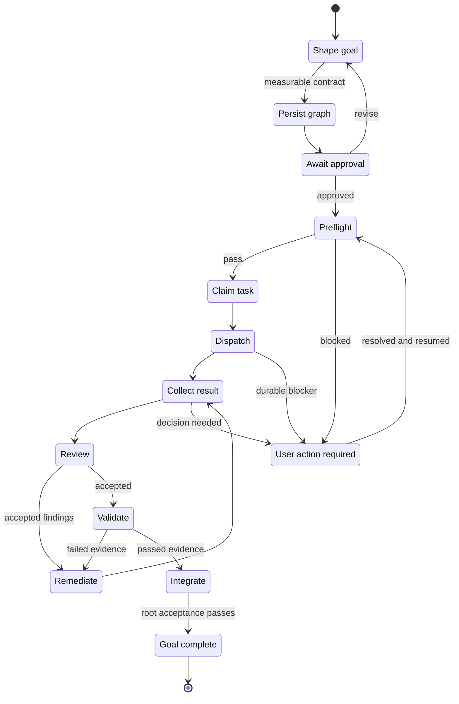

# Workflow guide

Agentflow separates durable project state from disposable agent sessions.
Beads records goals, tasks, dependencies, claims, decisions, and acceptance
evidence. Git and GitHub remain authoritative for source history, issues, pull
requests, reviews, and merges.

## Lifecycle at a glance

The approved root controller advances the graph until the goal is complete or
a durable decision is required. Provider panes and individual tasks are
intermediate state, not completion signals.

One controller chat should own one approved root. Related review and remediation
remain children of that root; a materially different goal starts a new root in a
fresh chat. Agentflow records a task-aware session budget and can produce a
minimal `controller rotate` packet so another chat resumes from Beads and
controller state rather than replaying a transcript. Rotation advice never
interrupts an autonomous root. Repeating the same named failed approach twice
does create a durable decision halt.



`USER_ACTION_REQUIRED` preserves the root, claims, results, and evidence. Resume
the existing root after resolving the recorded cause; do not create a duplicate
graph or treat a disconnected chat as a new workflow.

## Default lifecycle

1. Define an observable goal and approve its exit conditions.
2. For substantial or environment-dependent work, map each acceptance
   condition to authoritative evidence.
3. Create bounded Beads tasks with explicit dependencies and ownership.
4. Select a native worker or an observable external session.
5. Preflight the exact base, tools, skills, output boundary, budget, retries,
   and delegation depth.
6. Claim work before mutation and keep concurrent writers in disjoint scopes.
7. Return structured outcome and evidence, not a transcript dump.
8. Review changes independently and route accepted corrections to their owner.
9. Integrate ready work in priority/FIFO order and validate the original goal.

## Execution lanes

Use native subagents for bounded, fire-and-forget work. Use Herdr or `tmux` for
long-running, cross-provider, worktree-owned, or decision-prone sessions where
observation or direct intervention is useful. A live pane is an attention
signal, never proof of correctness or completion.

External launches consume provider allowance and therefore remain explicit
unless an approved controller is operating within its recorded budget.

## Durable Beads coordination

Initialize Beads deliberately:

```sh
agentflow init . --beads
agentflow beads status .
```

Use one approved root for an Agentflow queue. Each task needs an observable
result, exact scope, dependencies, acceptance evidence, checks, constraints,
and a halt condition. Claims are actor-bound and time-bounded. A task being
ready or assigned does not prove that a worker session is live.

Gitless projects can use Beads and Agentflow runtime state without inventing
branches, commits, pull requests, or merge gates. Serialize overlapping file
writes in that mode.

## Skill routing

Keep domain skills with the project or register them through Agentflow's skill
configuration. Name required skills in every delegated assignment. Preflight
from the worker's actual checkout and stop if a required entrypoint or content
digest cannot be verified. See [SKILLS.md](SKILLS.md).

## Handoff contract

A useful assignment states:

```text
objective: one observable result
scope: owned files or read-only question
base: branch and exact revision
dependencies: task identifiers or none
acceptance: testable conditions
verify: exact commands or evidence sources
constraints: permissions and do-not rules
budget: time/cost cap, retry cap, and stop condition
return: outcome, revision, checks, risks, and references
```

If blocked, the worker stops and returns one decision or dependency, what was
tried, available options, a recommendation, and preserved state.

## Review and integration

Reviews should distinguish correctness, security, regression, and missing-test
findings from preferences. High- and medium-severity findings require exact
evidence and deterministic reproduction before they are routed as corrections.
The original writer owns fix rounds when practical; reviewers do not silently
rewrite another worker's scope.

Workers do not merge their own pull requests. Integrate one completed branch at
a time, verify its recorded base, and rerun affected checks after integration.

## Hooks

Agentflow hooks are small and advisory. They may record lifecycle events or
provide a workflow reminder, but they do not inspect prompts to select domain
expertise, publish issues, approve goals, or decide that work is complete.
Initialization preserves custom hooks for deliberate manual merging.

## Evidence and privacy

Record commands, revisions, test results, and links that substantiate the goal.
Do not store prompts, reasoning traces, credentials, provider logs, or account
data as durable coordination state. Metadata-only audit and history facilities
do not make private material safe to publish.
